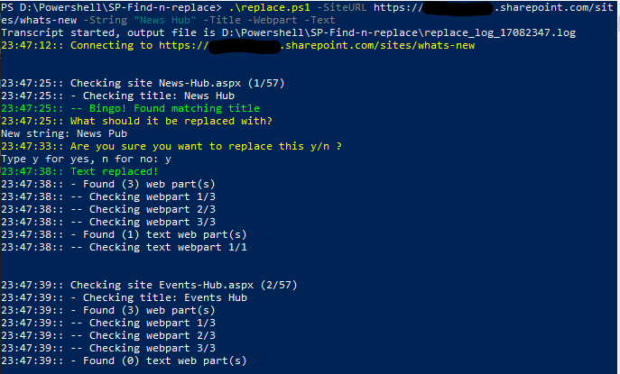

# SP-Replacer
## Find and replace for Sharepoint text webparts
SP Replacer loops through a Sharepoint Modern site collection site Pages, 
checks text webparts on the Page, finds the String given to it, 
and prompts what should it be changed.

## Example run

## Version history
|Version|Date|Updates|
|--|--|--|
|1.0|16.8.2022|Initial version|
